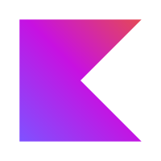
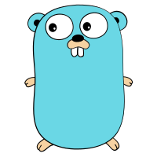
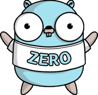
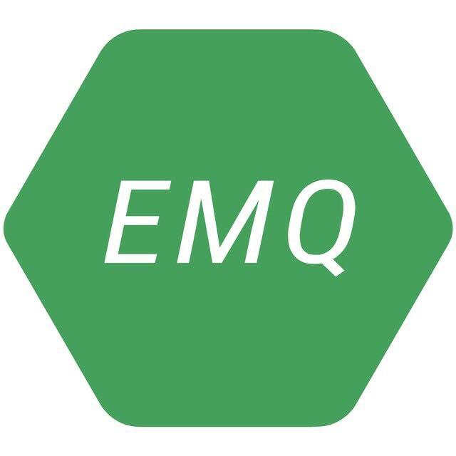
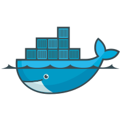
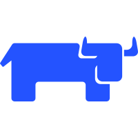

**About Me:**  `Full Stack Developer`

| ` Java `  | `Kotlin` | `Golang` | `Java Scipts` | `CSharp` | `C/C++` |  `Rust` |
| :---: | :----: | :----: | :---: | :---: | :---: | :---: |
|   |  |  |  |  | |   |
  
| `Spring` | `Go Zero` | `VueJS` | `NuxtJS` | `Quasar` | `Uniapp` | `Android` | 
| :----: | :-----: | :---: | :----: | :----: | :----: | :-----: |
|  |  |  |  |  |  |  |

| `Nginx`  | `Traefik` | `Higress` | `RabbitMQ` | `RocketMQ` | `Kafka`  | `EMQX`  |
| :----: | :-----: | :-----: | :------: | :------: | :----: | :---: |
|  |  |  |  |  |  |  |

| `MySQL`  | `TiDB`   | `Redis`  |  `Elastic Search` | `Kibana` | `Click House` | `Victoria Metrics` |
| :----: | :----: | :----: | :------------: | :----: | :--------: | :-------------: |
|  |  |  |  |  |  |  | 

| `Docker` |  `K8S`  | `Rancher` | `Prometheus` | `Grafana` | `Sky Walking` | `Open` `Telemetry` |
| :----: | :---: | :-----: | :--------: | :-----: | :--------: | :-----------: |
|  |  |  |  |  |  |  | 

| `Windows`  |  `Darwin`  |   `Linux`  | `Debian`   |  `Ubuntu`  | `CentOS`   | `Manjaro` |
| :------: | :------: | :------: | :------: | :------: | :------: | :-----: |
|  | |  |  |  |   |  | 

**My Organizations:**

 [https://github.com/gankcode](https://github.com/gankcode)

 [https://github.com/bytebusy](https://github.com/bytebusy)

 [https://github.com/harmonychaos](https://github.com/harmonychaos)

 [https://github.com/chaos-plus](https://github.com/chaos-plus)

 [https://github.com/htmlos](https://github.com/HtmlOS)

---

  

---

<!--

  
  

---
-->

  <!-- <a href="https://github.com/robotism/github-stats"> -->
    <!--  -->
    <!--  -->
  <!-- </a> -->

---

  

---

