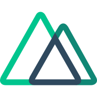
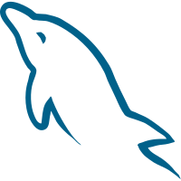
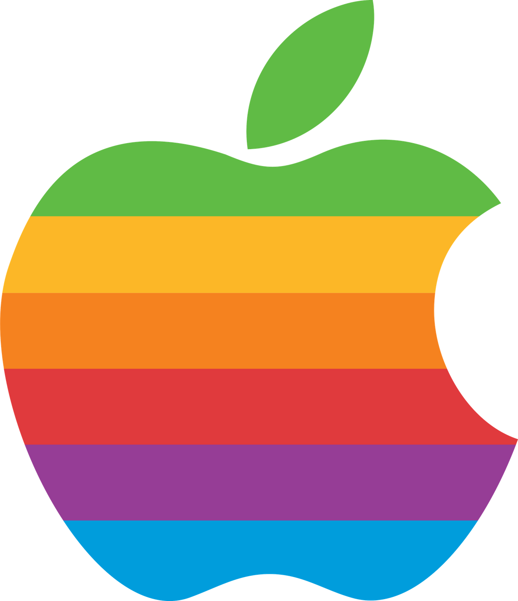

**About Me:**  `Full Stack Developer`

| Java  | Kotlin | Golang |   JS  |   C#  | C/C++ |  Rust |
| :---: | :----: | :----: | :---: | :---: | :---: | :---: |
|   |  |  |  |  | |   |
  
| Spring | Go-Zero | VueJS | NuxtJS | Quasar | Uniapp | Android | 
| :----: | :-----: | :---: | :----: | :----: | :----: | :-----: |
|  |  |  |  |  |  |  |

| Nginx  | Traefik | Higress | RabbitMQ | RocketMQ | Kafka  | EMQX  |
| :----: | :-----: | :-----: | :------: | :------: | :----: | :---: |
|  |  |  |  |  |  |  |

| MySQL  | TiDB   | Redis  |  Elastic Search | Kibana | ClickHouse | Victoria Metrics |
| :----: | :----: | :----: | :------------: | :----: | :--------: | :-------------: |
|  |  |  |  |  |  |  | 

| Docker |  K8S  | Rancher | Prometheus | Grafana | Skywalking | Open Telemetry |
| :----: | :---: | :-----: | :--------: | :-----: | :--------: | :-----------: |
|  |  |  |  |  |  |  | 

| Windows  |  Darwin  |   Linux  | Debian   |  Ubuntu  | CentOS   | Manjaro |
| :------: | :------: | :------: | :------: | :------: | :------: | :-----: |
|  | |  |  |  |   |  | 

---

  

---

<!--

  
  

---
-->

  

---

  

---

